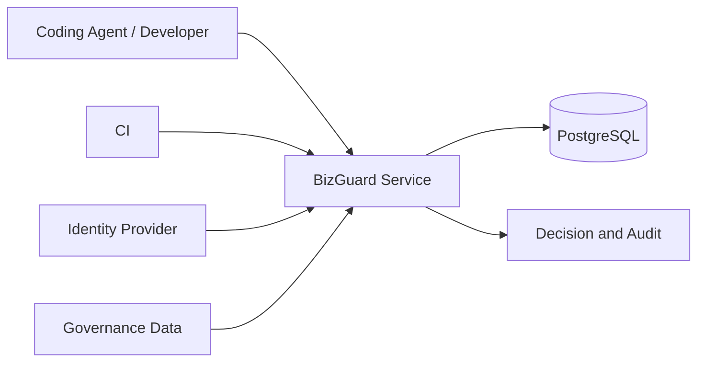

# BizGuard 生产部署概览

本文只描述生产部署的高层方案。详细配置、组织阈值和运维步骤应保存在内部文档中，并由实际使用团队维护。

## 部署架构

生产环境由四部分组成：

- **BizGuard 服务**：通过 MCP 或 CI 接收任务与代码变更；
- **治理数据**：提供服务目录、业务规则、契约、Owner 和必测项；
- **持久化存储**：保存 Context、图快照、审批状态和审计记录；
- **身份与执行环境**：完成调用方认证，并在可信 CI 中运行测试。

## 基本原则

- 受管代码仓库和治理数据默认只读；
- 身份、权限和数据范围由服务端校验；
- 测试结果必须由可信 CI 产生并绑定代码版本；
- 审批必须绑定当前变更及规则版本，不能复用过期结论；
- 服务异常、版本未知或关键证据缺失时不得自动放行；
- 密钥、令牌和真实业务数据不得提交到代码仓库。

## 上线步骤

1. **准备治理数据**：确认服务、契约、Owner、规则和必测项来自真实系统；
2. **影子验证**：只记录结果，不阻断变更，评估覆盖率和误报；
3. **告警运行**：对明确风险给出提示，保留人工判断；
4. **有限阻断**：仅启用已校准、可回退且责任人明确的关键规则；
5. **持续复盘**：根据事故、误报、审批负担和索引新鲜度调整治理数据。

## 上线检查

- 身份认证、权限隔离和只读挂载已验证；
- 数据库备份、恢复、扩容和健康检查已演练；
- 规则具有真实样本、Owner 批准和回退方案；
- CI 能重新计算决策并保存版本绑定证据；
- 日志和审计记录不包含密钥、完整敏感文档或未经授权的数据。

只有上述检查在目标组织环境中完成后，才能逐步启用阻断能力。
