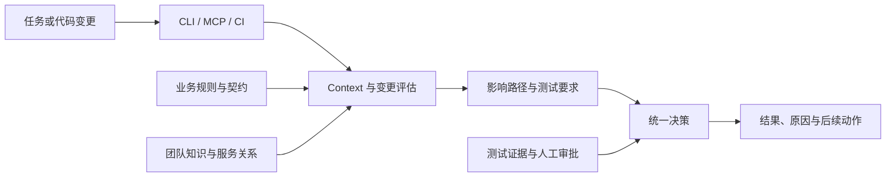

# BizGuard：业务变更安全门禁

BizGuard 面向复杂业务系统，为 Coding Agent、开发者和 CI 提供一致的业务上下文与变更校验能力。它把业务规则、跨服务影响、测试证据和人工审批汇总为可追溯的变更决策，降低代码修改遗漏隐含约束的风险。

当前仓库使用脱敏的 Java 微服务和 Python 示例构建可复现演示。内置规则仅用于验证技术方案，接入真实生产环境前仍需由业务 Owner 校准和审批。

## 解决的问题

业务系统的关键约束往往分散在代码、接口、消息、数据库、事故复盘和团队约定中。只检查单个 diff，容易遗漏以下风险：

- 跨服务接口或消息字段的不兼容变更；
- 幂等、状态流转和账务顺序等业务不变量被破坏；
- 动态映射、反射或索引过期造成的未知影响边界；
- 测试、审批与当前代码版本不一致。

BizGuard 将这些信息组织为版本化证据，并在无法证明安全时要求补充测试或人工审批，而不是静默放行。

## 核心能力

- **变更前上下文**：根据任务、仓库版本和权限生成精简的 Context Pack。
- **变更后校验**：对 diff 执行业务规则检查和跨服务影响分析。
- **统一决策**：输出 `ALLOW`、`ALLOW_WITH_TESTS`、`REQUIRE_APPROVAL` 或 `BLOCK`。
- **多入口一致性**：CLI、MCP 和 CI 共用同一套核心判断。
- **证据可追溯**：结论关联规则版本、源码位置、必测项和审批状态。

## 高层架构



架构分为三层：

1. **接入层**接收任务描述、代码差异和版本信息；
2. **分析层**组合规则校验、知识检索和影响分析；
3. **治理层**结合测试与审批证据输出最终决策。

生产部署可使用 PostgreSQL 保存 Context、审批、审计和版本化图快照，并通过受保护的治理目录加载组织规则。

## 执行流程

一次变更按以下路径处理：

1. 确认仓库基线和治理数据版本；
2. 生成与当前任务相关的业务上下文；
3. 分析 diff、业务规则和跨服务影响；
4. 汇总必测项、未知边界及所需审批；
5. 输出统一决策，并由 CI 在可信环境中复核。

## 快速体验

环境要求：Python 3.12+；完整 Java 演示需要 JDK 17。

```bash
git clone https://github.com/PureBlueFrank/biz-guard.git
cd biz-guard
python3 -m venv .venv
source .venv/bin/activate
pip install --prefer-binary -e '.[dev]'
./scripts/demo.sh
```

演示覆盖关键规则拦截、低风险变更放行、非法输入、动态边界和跨服务影响等场景，并使用固定样例保证结果可复现。

单独校验一个 diff：

```bash
bizguard check --diff sample/diffs/diff_violation_1.diff
```

运行离线验证：

```bash
./scripts/verify_install.sh --offline
```

## 项目结构

```text
biz-guard/
├── src/bizguard/       # 核心领域、分析、决策与工作流
├── agents_mcp/         # MCP 接入层
├── policy/             # 示例规则与治理配置
├── registry/           # 示例契约注册表
├── knowledge/          # 脱敏知识样例
├── fixtures/           # 脱敏微服务样例
├── bench/              # 离线评测数据
├── tests/              # 自动化测试
└── scripts/            # 演示与验证脚本
```

## 当前边界

- 示例 Policy 未经过真实组织的生产校准，不能直接作为生产阻断规则；
- 动态调用或证据不足时，系统会返回未知边界并要求审批；
- 生产效果取决于真实服务目录、契约、Owner、测试和知识数据的质量；
- 项目提供的是变更治理基础设施，不替代代码评审和领域专家判断。

简要部署方式和上线阶段见 [PRODUCTION.md](PRODUCTION.md)。代码贡献约定见 [CONTRIBUTING.md](CONTRIBUTING.md)。
