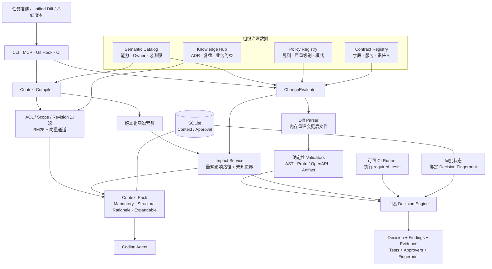

# BizGuard：给 AI 编程助手加一道业务安全门禁

> 在改代码之前补齐业务上下文，在提交变更之后用确定性证据决定是否放行。

BizGuard 是一个面向复杂业务系统的开源验证项目。它通过 MCP、CLI 和 CI 为 Claude Code、Codex、Cursor 等 Coding Agent 提供三类能力：

- **改前准备**：把业务 Policy、团队知识、跨服务影响和必测项编译成有版本、有来源的 Context Pack；
- **改后校验**：对 unified diff 执行确定性规则检查和跨服务影响分析；
- **变更门禁**：把规则、测试、未知边界和审批聚合成 `ALLOW`、`ALLOW_WITH_TESTS`、`REQUIRE_APPROVAL` 或 `BLOCK`。

BizGuard 不替代 Coding Agent、代码评审或领域专家。Agent 继续负责搜索、生成、编辑和测试，BizGuard 专注回答：**这次修改必须知道什么、可能影响谁、满足哪些条件才可以继续？**

当前实现以三个脱敏的 Java 17 微服务 fixture 和一组 Python 业务不变量为验证基座，并提供单实例生产部署基线。内置 Policy 尚未经过任何组织的真实生产审批，不能直接作为生产 Blocking 规则使用。

## 为什么需要 BizGuard

在优惠券、交易、履约、供应链等系统中，代码只是业务语义的一部分：

- 一个看似多余的幂等检查，可能在防止重复核销；
- 一个当前仓库没有引用的 DTO 字段，可能仍被 RPC、MQ 或离线任务消费；
- 一次状态更新顺序，可能承担一致性、审计或资损防护职责；
- 一段动态映射或反射代码，可能让静态分析无法证明影响边界。

项目指令、RAG 和 LLM Review 可以提供线索，但单独作为门禁仍有明显缺口：知识会过期，Prompt 可能被弱化，单仓库搜索看不到完整调用链，概率性判断也难以稳定复现。

BizGuard 的处理原则是：

1. **可确定的规则交给确定性 Validator**，不让模型猜；
2. **跨服务影响必须带版本和证据路径**，不只给风险标签；
3. **没有发现风险不等于已经证明安全**，未知边界进入审批；
4. **测试和审批绑定到具体 diff、基线与 Policy 版本**，避免复用过期结论。

## 快速体验

### 环境要求

- Python 3.12+
- JDK 17（Demo 会真实编译 Java fixture）

```bash
git clone https://github.com/PureBlueFrank/biz-guard.git
cd biz-guard

python3 -m venv .venv
source .venv/bin/activate
pip install -e '.[dev]'
```

离线环境需要预先准备构建依赖 `hatchling`，再执行：

```bash
pip install --no-build-isolation -e '.[dev]'
```

### 一条命令运行完整 Demo

```bash
./scripts/demo.sh
```

脚本使用固定 seed，离线执行并自校验以下 6 个场景；任何结果偏离预期都会以非零状态退出。

| 场景 | 输入 | 预期结果 | 证明了什么 |
| --- | --- | --- | --- |
| 1. 启发式对照 | 跨服务 DTO 破坏性变更 | 对照组 `ALLOW`，BizGuard `REQUIRE_APPROVAL` | 只看 diff 文本容易漏掉跨服务影响 |
| 2. 关键规则违规 | 删除核销幂等检查 | `BLOCK` | AST Policy 能定位被破坏的不变量 |
| 3. 低风险变更 | 日志级别调整 | `ALLOW` | 必需测试真实执行并形成版本绑定证据 |
| 4. 非法输入 | 不存在的 diff 文件 | `CHECK_INCOMPLETE` | 检查失败不会静默放行 |
| 5. 动态边界 | 重命名反射映射方法 | `REQUIRE_APPROVAL` | 无法证明的边界会返回原因、证据和 Owner |
| 6. 跨服务链路 | MQ 消费者字段变更 | 输出完整影响路径 | 路径跨越消费者、Topic、生产者、仓库、服务和业务能力 |

> 场景 1 的 Naive Baseline 是仓库内的离线启发式对照，不是真实 Claude Code 或 Codex。只有 benchmark 的 `--live` 模式会调用真实 Agent。

### 看懂一次 `BLOCK`

违规样例删除了核销事务中的幂等校验：

```diff
 @transaction
 def redeem(self, coupon_id: str, idempotency_key: str) -> None:
-    IdempotencyStore.check(idempotency_key)
     self.ledger.redeem(coupon_id)
```

运行：

```bash
bizguard check --diff sample/diffs/diff_violation_1.diff
```

输出中的关键字段为：

```text
decision:   BLOCK
rationale:  critical policy violation
finding:    redeem-must-check-idempotency-in-transaction
effect:     目标方法缺少要求的幂等保护调用。
evidence:   redeem-must-check-idempotency-in-transaction
```

这里的结论不是 LLM 生成的风险意见。BizGuard 会在内存中把 diff 应用到受保护文件的基线文本，重新解析 AST，并验证事务装饰器、幂等调用、参数和调用顺序；工作区文件不会被修改。

### 单独观察跨服务影响

```bash
bizguard impact analyze \
  --diff bench/fixtures/phase3/mq-status.diff \
  --repos fixtures/java-microservices \
  --revision-set bench/fixtures/phase3-revisions.yaml \
  --format json
```

该场景会返回一条可追溯路径：

```text
merchant-service consumer
  → mq://coupon-core/coupon.redeemed#status
  → coupon-core producer
  → repo://coupon-core
  → service://coupon-core
  → capability://coupon-redemption
```

每条边都包含 `source`、`confidence`、`revision` 和 `evidence_uri`，因此调用方可以继续定位到具体源码或 catalog 记录。

## 技术架构

BizGuard 不是一个“让 LLM 再审一次代码”的代理层。它由两条共享治理数据的运行时主链组成：

- **Context 链**在修改前工作，为 Agent 编译最小且可追溯的业务上下文；
- **Decision 链**在 diff 产生后工作，为 CLI、MCP、Hook 和 CI 生成同一个规范化决策。



### 1. 改前：Context Pack 编译链

`prepare_change` 或 `bizguard prepare` 接收任务、仓库集合、基线 revision 和调用方角色，随后执行：

1. 校验每个仓库的基线版本，并为当前内容建立版本化图快照；
2. 从任务中选择候选符号和业务能力；未找到可靠符号时显式记录 `NO_MATCHING_SYMBOL`；
3. 使用 BFS 查找到业务能力、Owner 或不变量的最短真实路径；
4. 在排序前按 ACL、scope、发布状态、有效期和 revision 过滤团队知识；
5. 合并必需 Policy、结构路径、知识依据、必测项、审批人、未知项和证据；
6. 按 token budget 裁剪可展开信息，但不删除 Mandatory Policy 和证据 ID。

最终的 Context Pack 分为四层：

| 层 | 内容 | 裁剪策略 |
| --- | --- | --- |
| `Mandatory` | 必须遵守的 Policy、不变量和证据 ID | 不裁剪 |
| `Structural` | 候选符号、影响路径和分层图谱 | 预算不足时后裁剪 |
| `Rationale` | ADR、复盘和知识摘要 | 优先裁剪 |
| `Expandable` | 检索候选轨迹、语义通道状态 | 最先裁剪 |

这样做的目的不是把整个知识库塞进 Prompt，而是让 Agent 先拿到不可丢失的约束，再按证据链接展开细节。

### 2. 改后：统一决策链

所有需要统一四态结论的入口最终委托给 `ChangeEvaluator`，而不是各自实现一套判断逻辑：

```text
unified diff
  → 解析并在内存中重建变更后文件
  → Policy / Contract 确定性校验
  → 版本化跨服务影响分析
  → 汇总 required_tests 与 Owner
  → 校验 revision 绑定的测试证据
  → 校验 diff + revision + policy + tests + owners 的审批指纹
  → 输出规范化 ChangeDecision
```

决策引擎按硬条件顺序收敛，风险分数不能覆盖关键违规：

| 优先级 | 决策 | 触发条件 | 如何继续 |
| --- | --- | --- | --- |
| 1 | `BLOCK` | 存在 critical Policy 违规 | 修复违规；审批不能覆盖 critical violation |
| 2 | `REQUIRE_APPROVAL` | 关键边界或版本未知 | 补充边界证据并取得匹配 Owner 的有效审批 |
| 3 | `ALLOW_WITH_TESTS` | 已识别必测项，但缺少可信且同 revision 的通过证据 | 由可信 CI Runner 执行必测项 |
| 4 | `REQUIRE_APPROVAL` | 公共契约/多 Owner 变更，或风险达到审批阈值 | 取得与当前 Decision Fingerprint 匹配的审批 |
| 5 | `ALLOW` | 所有硬条件满足，测试和审批条件均已闭环 | 可以继续 |

无法解析输入的旧校验入口会返回 `CHECK_INCOMPLETE`；CI 对未知决策返回退出码 2，避免“工具出错等于检查通过”。

### 3. 影响图谱与证据模型

图谱包含 8 类节点：组织、部署、代码、接口、数据、消息、运行时和业务。索引器从 Java AST、OpenAPI/Proto、持久化、消息链路、catalog 和人工声明边中抽取关系；版本匹配的 runtime trace 可以再作为观测边合并到图快照，且不会覆盖静态证据。

实体使用稳定 URI 表示，例如：

- `repo://coupon-core/...#RedeemService.redeem(...)`
- `api://coupon-contract/POST/redeem`
- `proto://coupon.v1/CouponService/Redeem`
- `db://coupon-core/coupon_redemption#status`
- `mq://coupon-core/coupon.redeemed#status`
- `capability://coupon-redemption`

影响分析只沿真实图边执行 BFS。找不到已索引路径或遇到动态映射时，它返回 `NO_INDEXED_ROUTE` 或 `DYNAMIC_BOUNDARY`，而不是补造一条看似合理的链路。

### 4. 治理数据与执行边界

| 数据 | 作用 | 默认位置 |
| --- | --- | --- |
| Semantic Catalog | 定义能力、Owner、实体、Policy 和 required tests | `src/bizguard/semantic/catalog.yaml` |
| Policy Registry | 定义 Validator、scope、严重级别、模式和修复指引 | `policy/phase5-registry.yaml` |
| Contract Registry | 把字段和源码映射到服务、能力、Owner 与 Policy | `registry/contracts.yaml` |
| Invariants | 描述可执行的业务不变量 | `policy/invariants.yaml` |
| Knowledge Hub | 保存带 front matter、版本、ACL 和有效期的已发布知识 | `knowledge/published/` |

生产 HTTP 模式不会回退到镜像内置的 Demo 数据。catalog、Policy registry、contract registry、invariants 和两类知识目录必须由组织显式挂载，缺少任一项都会拒绝启动。

## 接入 Coding Agent

### CLI

```bash
# 编译 Agent 可读的 Context Pack
bizguard prepare --task "检查优惠券状态字段变更" \
  --repos coupon-core coupon-contract \
  --base-revisions bench/fixtures/phase3-revisions.yaml \
  --json

# 分析 unified diff
bizguard check --diff sample/diffs/diff_violation_1.diff

# 搜索受治理的团队知识
bizguard knowledge search \
  --query "优惠券核销必须使用幂等键" \
  --scope coupon_redemption \
  --revision semantic-seed-v1 \
  --roles engineering \
  --json

# 诊断本地安装
bizguard doctor --json
```

### MCP

先预览配置，再写入 Codex 官方 MCP 配置：

```bash
bizguard connect codex --repository . --dry-run
bizguard connect codex --repository . \
  --identity coupon_platform \
  --roles engineering
```

BizGuard 提供 8 个 MCP Tool：

| Tool | 类型 | 用途 |
| --- | --- | --- |
| `prepare_change` | 只读 | 编译并持久化 Context Pack |
| `search_team_knowledge` | 只读 | 按服务端身份执行 ACL、scope 和 revision 过滤检索 |
| `explain_symbol` | 只读 | 返回符号详情和图谱证据 |
| `analyze_impact` | 只读 | 返回影响路径、未知边界、必测项和 Owner |
| `validate_patch` | 只读 | 为旧客户端提供确定性 diff 校验 |
| `get_required_tests` | 只读 | 从 catalog 选择 required tests |
| `request_approval` | 写入 | 创建或推进持久化审批请求 |
| `get_change_decision` | 只读 | 返回统一四态决策；调用方不能自行声明测试已通过 |

安装后可验证真实工具 schema、MCP 调用、动态边界和 CI 复检：

```bash
./scripts/verify_install.sh --offline
```

## CI 门禁

生产 CI 应使用可信 runner，而不是向决策接口传一个 `tests_passed=true`：

```bash
python -m bizguard.ci.runner \
  --diff /ci/pr.diff \
  --base-revisions /ci/base-revisions.yaml \
  --repository-root /workspace/repos \
  --test-root /workspace/repos \
  --test-evidence-out /ci/test-evidence.json \
  --audit-log /ci/audit.jsonl \
  --json
```

Runner 会先发现 `required_tests`，再以参数数组而非 shell 执行 catalog 中的命令，为每个 Test ID 生成绑定 revision 的哈希证据，最后重新计算决策。建议从受保护的基线 revision 或固定摘要镜像运行 BizGuard 和治理数据，避免待审 PR 同时修改门禁本身。

仓库内的 [GitHub Actions 工作流](.github/workflows/bizguard.yml) 展示了完整接法。

## 项目结构

```text
biz-guard/
├── src/bizguard/
│   ├── change/          # 统一 ChangeEvaluator 与规范化输入输出
│   ├── context/         # Context Pack 编译、缓存和持久化
│   ├── graph/           # 版本化图谱、索引和存储
│   ├── impact/          # BFS 影响分析与必测项推导
│   ├── knowledge/       # 知识摄取、治理过滤和混合检索
│   ├── policy/          # Policy registry、生命周期与 Validators
│   ├── workflow/        # 审批状态机和 SQLite 存储
│   ├── ci/              # CI 复检与可信测试 runner
│   └── cli.py           # CLI 入口
├── agents_mcp/          # FastMCP 工具、资源、认证和 HTTP 服务
├── fixtures/            # 三个脱敏 Java 17 微服务 fixture
├── sample/              # Python 示例服务与可复现 diff
├── policy/              # Demo Policy 和业务不变量
├── registry/            # Demo Contract Registry
├── knowledge/           # 已发布知识、ADR 与评测素材
├── bench/               # 黄金集、holdout 和五组消融实验
├── tests/               # 自动化测试
├── scripts/             # Demo、安装验证和 benchmark 脚本
└── docs/adr/            # 架构决策记录
```

## Benchmark

仓库提供 5 组可离线重放的消融轨道：`Naive Baseline`、`Rules Only`、`RAG Only`、`Context` 和 `Full`。离线 Agent 轨道是 scripted/启发式基线，只用于比较组件贡献。

真实 Codex 轨道需要显式配置当前账号可用的模型和只读适配器：

```bash
export BIZGUARD_CODEX_MODEL="<已启用的 Codex 模型>"
BIZGUARD_LIVE_AGENT_COMMAND="python scripts/codex_agent.py" \
BIZGUARD_LIVE_TASK_ID="critical-ledger-1" \
python scripts/run_benchmark.py \
  --dataset bench/ablations/tasks.yaml \
  --live \
  --out bench/ablations/live_results.json \
  --transcript-out bench/ablations/codex_agent_transcript.json
```

适配器只向 Agent 暴露统一主链的 `get_change_decision`，并保存输入、工具调用、diff 哈希、完整输出和最终决策。只有 transcript 与 FastMCP 重放结果一致时，benchmark 才接受该记录。

## 生产运行

BizGuard 可作为带 Bearer Token 的 Streamable HTTP MCP 服务运行，当前生产基线包括：

- 非 root、只读根文件系统和最小 Linux capabilities 的容器；
- 只读挂载的受管仓库与组织治理目录；
- Context Pack 和审批的 SQLite 持久化；
- `/healthz`、`/readyz`、Host/Origin 限制和静态 Token 认证；
- 绑定 revision 的必需测试证据、审计记录和 CI 复算。

完整的配置项、Compose 启动、TLS/密钥边界、审批接入、shadow → warning → blocking 发布流程和回退要求见 [PRODUCTION.md](PRODUCTION.md)。

## 当前限制

- Java 分析能力只在 `coupon-core`、`coupon-contract`、`merchant-service` 三个脱敏 fixture 上验证，不代表覆盖完整 Java 生态。
- 内置 Policy 和阈值仅用于仓库验证；新组织必须先用真实样本校准，并经过 Owner 审核与回退演练。
- SQLite 只支持单服务实例；多 Pod、多区高可用需要替换为组织级共享存储 Provider。
- 目标 embedding 模型是智谱 `embedding-3`；离线模式降级为本地词法向量适配器，并在结果中标记 `DEGRADED`。
- 当前候选符号选择仍包含词法匹配；没有可靠匹配时会显式返回 unknown，不应把它解释为安全。
- 动态调用、反射和未登记下游无法靠静态分析完全证明；这些边界会转为审批，而不是自动放行。

## 开发与贡献

```bash
python -m ruff check src tests agents_mcp scripts
python -m mypy src tests agents_mcp
python -m pytest -q
```

欢迎阅读 [贡献指南](CONTRIBUTING.md)，并通过 Issue 或 PR 提交新的业务不变量、脱敏 fixture 和可复现案例。架构取舍记录在 [docs/adr/](docs/adr/)。
